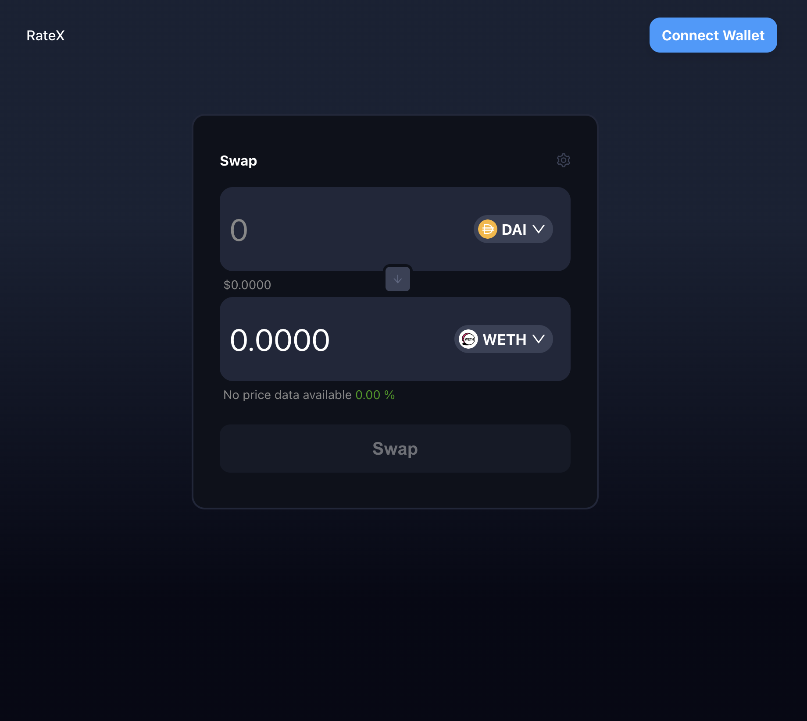

# 💡 RateX - A Decentralized DEX Aggregator

<div style='flex: 0.2; align="center"'>

</div>

## 🌟 Introduction

RateX is a decentralized DEX aggregator designed to integrate seamlessly into existing applications, enabling users to leverage the best trade routes across multiple decentralized exchanges without taking positive slippage or fees. This project focuses on offering a competitive alternative to current DEX aggregators, which are mostly closed source and may take positive slippage. RateX runs directly on the user's machine or in their browser, ensuring transparency and control over the routing process.

## Why are we making this?

Current DEX aggregators do not charge any fees but do take the positive slippage, if there is one. Slippage is the difference between the expected price of a trade and the price at which the trade is executed. Additionally, their routing algorithms are typically closed source, so if they suddenly started charging fees, they would effectively have no immediate competition.

Our idea was to create the **'competition'**. We would:

1. Not take the positive slippage and fees.
2. Make the routing algorithm open source.
3. Create the code (SDK) to be executed on the user's machine (in browser), instead of on a server.

## ✨ Features

- 🔍 **Optimal Route Discovery** across multiple DEXes
- 💰 **No Fees or Positive Slippage**
- 🖥️ **Client-side Execution**: Ensures transparency and security.
- 🔓 **Open-Source**: Promotes community-driven development.
- ⚡ **Support for Arbitrum and Ethereum networks**

## Getting Started

This repository includes both a frontend and contracts that can be used with the existing RateX contracts to immediately start trading or, alternatively, provides users the option to deploy their own custom contracts to tailor the experience to their specific needs. 

## 🛠️ Requirements

Ensure you have Node.js installed

- [Node.js (>= v18)](https://nodejs.org/en/download/)

## 📦 Installation

In the project root directory, run the `postinstall` script to set up both the UI and contracts:

```bash
npm run postinstall
```

Copy code

## Running Frontend

Before starting the frontend, ensure you fill out the `.env` file based on the provided `.env.example` to configure the environment variables necessary for the application:

```plaintext
# .env file setup
REACT_APP_MAINNET_URL=<Your_Mainnet_Node_URL>
REACT_APP_ARBITRUM_URL=<Your_Arbitrum_Node_URL>
REACT_APP_GRAPH_API_KEY=<Your_Graph_API_Key>
```

Once the .env file is configured, navigate to the UI directory and start the application:

```bash
cd UI
npm run start
```

This will launch the frontend, where you can interact with the default RateX contracts or deploy and interact with your custom contracts if desired. If everything is set up correctly, you should see the following interface:

<div style='flex: 0.2; align="center"'>

</div>

### Setting Up Smart Contracts (Optional)

### 1. Compile and Test Contracts

Navigate to the `RateX/contracts` directory:

```bash
cd contracts
```

Compile the smart contracts and run tests to ensure everything is functioning correctly:

```bash
npx hardhat compile
npx hardhat test
```

### 2. Deploy Contracts

To deploy the contracts to a specific network, first ensure you have filled out the `.env` file based on the provided `.env.example` for contracts. Adjust environment variables accordingly:

```plaintext
# .env file setup for contracts
MAINNET_URL=<Your_Mainnet_Node_URL>
ARBITRUM_URL=<Your_Arbitrum_Node_URL>
TENDERLY_FORK_ID_MAINNET=<Your_Tenderly_Fork_Mainnet_Id>
TENDERLY_FORK_ID_ARBITRUM=<Your_Tenderly_Fork_Arbitrum_Id>
SECRET_KEY=<Your_Private_Key>
```

Then, run the deployment script:

```bash
npx hardhat run scripts/deploy --network networkName
```

### Local Development Environment

For local testing and development, follow these steps:

##### Start a local Hardhat node:

```bash
npx hardhat node
```

##### Deploy smart contracts to the local network:

```bash
npx hardhat run scripts/deploy.js --network localhost
```

##### Fund the first account on the Hardhat node to simulate transactions:

```bash
npx hardhat run scripts/utils/fundHardhat.js --network localhost
```

After setting up the local environment, navigate back to the RateX UI folder and start the application:

```bash
npm start
```

### Run on a Tenderly Fork

To use Tenderly for a simulated blockchain environment:

1. Create a Tenderly fork.
2. Ensure you fill in the `.env` values in both the contracts and UI directories.

Position yourself in the `RateX/contracts` folder and deploy the smart contracts to your Tenderly fork:

```bash
npx hardhat run scripts/deploy.js --network tenderly
```

Fund the first wallet account on the Tenderly fork to simulate transactions:

```bash
npx hardhat run scripts/utils/fundTenderly.js --network tenderly
```

Finally, from the RateX folder, start the frontend application:

```bash
npm start
```

## 📄 License

This project is licensed under the MIT License - see the [LICENSE](LICENSE) file for details.

## 🙏 Acknowledgements

Special thanks to [Decenter](https://www.decenter.com/) internship teams for supporting this project and all the contributors who made this possible.

## 📬 Contact

For any questions or support, please open an issue on our [GitHub repository](https://github.com/your-repo-link).

---

Built with ❤️ by the RateX team
