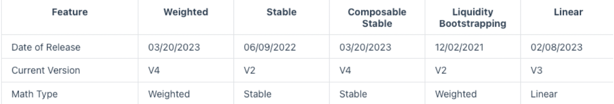
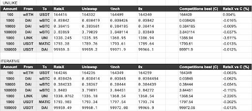

# Introduction
The purpose of this project was to create a decentralized open source DEX aggregator on Arbitrum.

## What is a DEX?
DEX is a decentralized exchange where users can trade token A for token B. DEXes have many pools and every pool have 2 or more tokens. The price of a token depends on the ratios of all the 
tokens in the pool. Each DEX has mechanisms to determine how much token B they can give back for 
some input amount of token A. 

## What is a DEX aggregator?
Aggregators job is to find the best swap route so the output amount of token B highest possible. 
Each DEX usually has an internal router that only goes through the pools of that DEX. Best aggregators route through pools of numerous DEXes - current leaders are [0x](https://0x.org/products/swap) and [1inch](https://app.1inch.io/#/1/classic/swap/ETH). 

## Why are we making this?
Current DEX aggregators do not charge any fees but do take the positive slippage, if there is one.
Slippage is the difference between the expected price of a trade and the price at which the trade is executed. Also, their routing algorithms are closed source so if they suddenly started charging fees they effectively have no immediate competition.

Our idea was to create the 'competition'. We would:
1. not take the positive slippage and fees
2. make quoting algorithm open source
3. create the code (SDK) executed on the user's machine (in browser for example), instead of a server

## How does the app find best quote
1. We get pool addresses info from Graph API (because we need top pools in DEX we are looking for, but also top pools for each token in token pair that we are looking to swap). We decided to go with the Graph API because we need to sort the info by some TVL metrics in our SDK, and on-chain doesn't support that.
2. Fetch additional pool info on-chain for each DEX individually (Check helper contracts for more info).
3. Place those pool info into SDK algorithm for finding the best route. Algorithm calculates swap amount out off-chain, using our calculation extracted from solidity implementations (for each DEX we have special calculation). Our SDK has 2 algorithms: 
    - Uni-like algorithm
    - Iterative DP algorithm
 
<b>_NOTE:_</b> Both algorithms have split functionalities.

4. Display best route and execute swap

## Dexes integrated
| Supported DEX                         | Arbitrum TVL ($) - 01.09.2023 |
|---------------------------------------|-------------------------------|
| Uniswap V3                            | 207.98 milion                 |
| Balancer (pools with weighted math)   | 85.46 milion                  |
| Camelot                               | 57.36 milion                  |
| Sushiswap V2                          | 42.09 milion                  |
| Curve                                 | 25.37 milion                  |

<b>_NOTE ON BALANCER:_</b> 
[Balancer pools](https://docs.balancer.fi/concepts/pools/more/deployments.html) implement 3 types of math:
1. Weighted (we support this)
2. Stable (we have **tried** to support this, feel free to correct the code so it can be integrated)
3. Linear (for Boosted pools - critical vulnerability on 22.08.2023. and all the liquidity has been withdrawn)

  

# Results
We have two algorithms for finding quote (more on them in later sections). Both of them showed competitive rates for different pairs of tokens and different amounts.
 

  

 

# About the creators
Creators of RateX are interns at [Decenter](https://www.decenter.com/), Web3.0 company celebrated mostly for their product [DeFi Saver](https://defisaver.com/). Here's the list of the people that worked:

- [Rajko Zagorac](https://www.linkedin.com/in/rajko-zagorac/) 
- [Dragan Mitrasinovic](https://www.linkedin.com/in/dragan-mitrasinovic/)
- [Irina Tomic](https://www.linkedin.com/in/irina-tomi%C4%87-64b6b3247/)
- [Daniil Grbic](https://www.linkedin.com/in/daniilgrbic/)
- [Branko Grbic](https://www.linkedin.com/in/branko-grbic-857335193/)

Special thanks to:

- [Nikola Markovic](https://www.linkedin.com/in/nikolamarkovicnmz/) - mentoring the project
- [Konstantnin Jaredic](https://github.com/kjaredic), [Nebojsa Majkic](https://www.linkedin.com/in/nmajkic/) - mentoring the solidity part
- [Nikola Klipa](https://www.linkedin.com/in/nikolaklipa/) - mentoring the algorithm part
- [Nikola Vukovic](https://www.linkedin.com/in/nikola-vukovic/) - mentoring the UI and TypeScript part of the SDK

And every other [Decenter member](https://www.decenter.com/team/) helping the project come to life!

 

