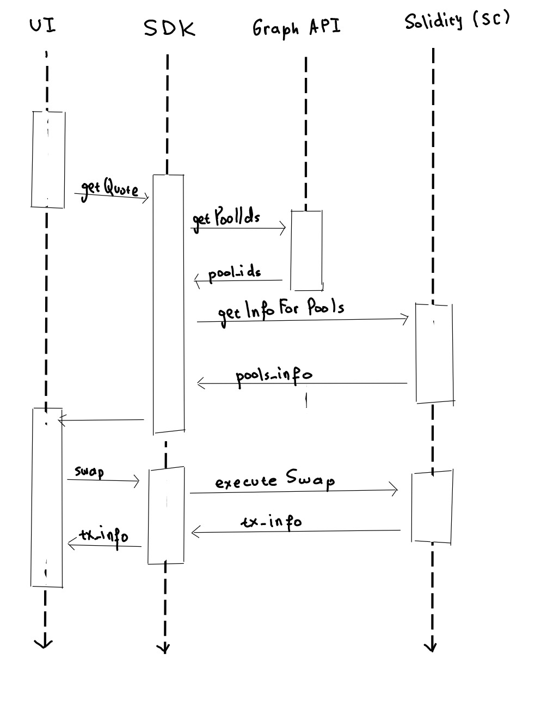
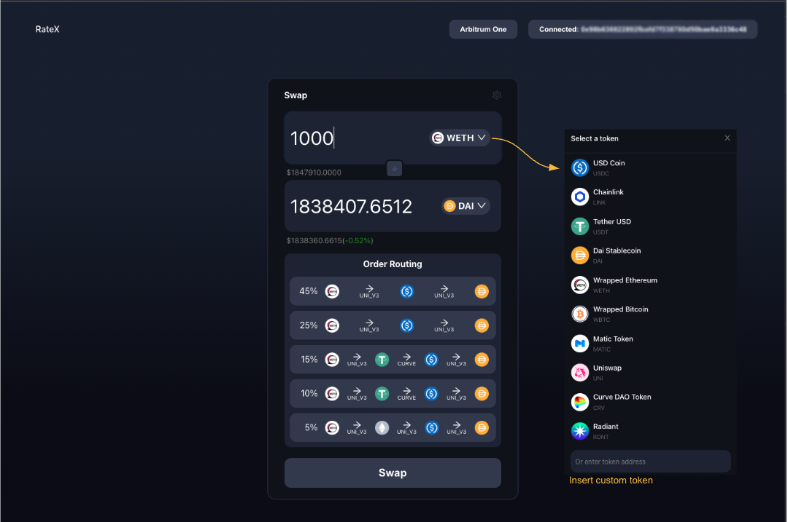

# The App
The app consists of 3 parts:
1. UI/UX
2. SDK (routing logic)
3. Solidity (pool data retrieval and swap execution)

The communication flow of the app is as follows:
<div style="display: flex; align-items: center; justify-content: space-between;">
  <!-- Left column for the image -->
  <div style="flex: 1;">
    
  </div>
  
  <!-- Right column for the text -->
  <div style="flex: 2; padding-left: 20px; word-wrap: break-word;">
    <p>
      IDs of the biggest pools (by TVL) for each DEX are fetched from the Graph API.
      The graph does not have the most fresh data, so the token balances in the
      pool are fetched on-chain. The SDK executes the routing algorithm to find the best 
      route and returns a quote to the user. The swap is executed on-chain.
    </p>
  </div>
</div>

## How the app looks
<div style="flex: 1;">
    
  </div>

## How to run

### Run locally
Fill in contracts/.env and UI/.env files (only the RPC provider part - alchemy key).
Position yourself in the RateX/contracts files and run:
```
npx hardhat node                                          - starting a local hardhat fork
npx hardhat run scripts/deploy.js --network localhost     - deploys smart contracts
npx hardhat run scrips/fundHardhat.js --network localhost - funds the first hardhat account
```
Then, from the RateX folder run `npm start`.

### Run on a Tenderly fork
Create a [Tenderly](https://tenderly.co/) fork and fill in contracts/.env and UI/.env files.
Position yourself in the RateX/contracts folder and run:
```
npx hardhat run scripts/deploy.js --network tenderly - deploys smart contracts
npx hardhat run scrips/fundTenderly.js --network tenderly   - funds the first wallet account
```
Then, from the RateX folder run `npm start`.


