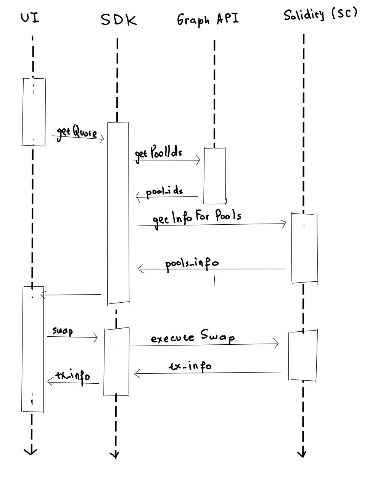

# Data retrieval
The problem of fetching fresh pools data is not an easy one. There is no universal on-chain database of pools for each DEX.  

## Ideal solution and its problems
The ideal solution would be to have a backend service that keeps track of all the created pools and to track their state in-real-time (catching all the events from Solidity - swaps, provided/withdrawn liquidity). Even just catching all the events is not as easy as it seems. For some DEXes the swap is executed on the Smart Contract of the pool (e.g. Curve), and for others, it is executed on the Swap Contract of some universal contract (e.g. Balancers Vault contract). 

Even then, when fetching the data, we would need to sort the pools by TVL (total value locked) and filter by tokens in the pool.

## Our solution
We've seen in the code of other DEXes and Aggregators that they use the [Graph API](https://thegraph.com/) for pool data retireval. So we have decided to do the same. We use the Graph API to fetch the largest pools by TVL (an information that rarely changes). We fetch only the structural information of the pool (id and tokens inside). 

Then, on-chain we fetch the balances of tokens in the pool for the freshest data. The logic for this can be seen in RateX/contracts/contracts folder.

## Communication flow
The flow graph of the app is as follows:

  <!-- Left column for the image -->
  

    
  

  
  <!-- Right column for the text -->
  

    

      ID's of the biggest pools (any TVL metrics can work - for example by liquidity, reserves in ETH etc.) for each DEX are fetched from the Graph API.
      The graph does not have the most fresh data, so the token balances in the
      pool are fetched on-chain. The SDK executes the routing algorithm to find the best 
      route and returns a quote to the user. The swap is executed on-chain.
    

  

