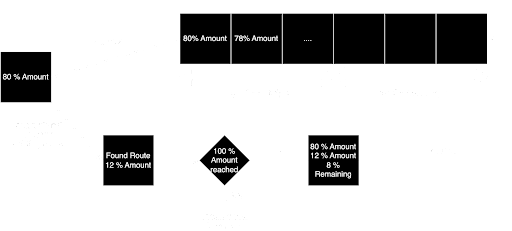

# Uni-like algorithm

## How it works

1. Find all possible routes from token `A` to token `B` (given pools fetched earlier).
2. Calculate output amount for every route (off-chain) including output amount for specific set of percentages (percentage step is set to _2%_ by default)
3. Combine routes to find best combination (using deque data structure). 
    - When we find best route and we see that we don't have 100% of input amount spent yet, we put that result back in dequeue from which we discover next best amount out and repeat process.

