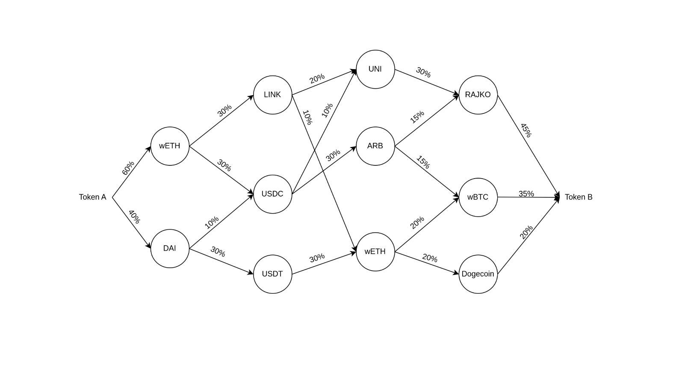

# Iterative splitting DP algorithm

The algorithm follows these steps:
1. Creating the pool graph
2. Finding the best route for part of the input amount (percentage determined by the `step` constant)
3. Allocating `step%` of the input amount to the current best route
4. Updating the local state of all the pools in the given route
5. Repeat steps 2-4 until the full input amount is allocated

## 0. Fetching the pools
We retrieve:
1. top N pools for tokenFrom and tokenTo are fetched from each DEX
2. top N pools by TVL from each DEX
3. top N pools that contain tokenFrom and tokenTo from each DEX (for a  possible direct swap)

## 1. Creating the pool graph
This is done using the `createGraph(pools: Pool[])` function. The function takes in an array of pools (retrieved from any implemented DEX), and returns the graph representation of those pools. 

The return type is `Map<string, Pool[]>` , mapping the address of each token that appears to all the pools contain it.

## 2. Finding the best route for part of the input amount
This is done in the `multiHopSwap()` function. The algorithm starts from the input token and checks all pools that contain that token, considering all other tokens in that pool. Every class extending Pool is required to implement the `calculateExpectedAmountOut()` function that is used here. All of these tokens are then used in the next iteration, in the same way. The number of iterations equals the constant `max_hops`.

As amounts of 2 different tokens can't reliably be compared, this is pretty much a brute force solution, stopping at the `tokenOut`. DP (memorization) is used so that we don't go through routes that we know are inferior from that start, meaning, they give less of a token than another route ending with the same token.

The return type is `Route`, containing the list of swaps made, as well as the input and output amount for the given route.

## 3. Allocating the input amount to the route
We keep track of allocations to each route in the routes Map.

## 4. Updating the local state of all the pools in the given route
This is done in the `updatePoolsInRoute()` function. We go through all of the pools in the route and call the `update()` function on them. This function has to be implemented by all classes extending Pool, and it updates the state of the pool. In most cases it just updates the reserves of tokens, but some cases are more complex (UniswapV3 for example).

## Finalizing the quote
The process is stopped when we allocate the whole 100% of the input amount. We return the quote containing all the routes used, with their given percentages, and the final expected output amount.

This is an example of the graph after route splitting allocations:

