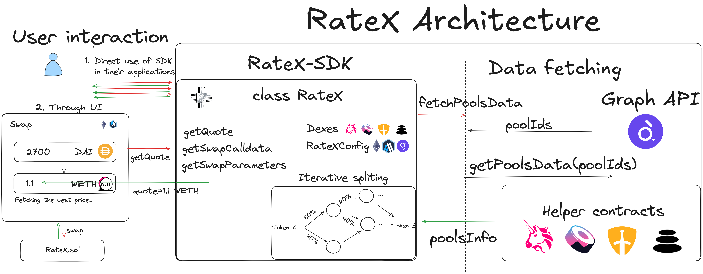

# 📦 RateX Architecture

## 🚀 Introduction

This document will explain some of the key components of the system architecture, including the SDK, data fetching mechanisms, smart contracts, and user interaction options.

---

## 🛠️ SDK Overview

Our SDK is designed to provide seamless interaction with the DEX aggregator, enabling users to efficiently find and execute the best swap routes across multiple DEXes on Arbitrum and Ethereum mainnet.

### ⚙️ Configuration and Supported DEXes

The SDK is highly configurable, allowing developers to tailor it to their specific needs. Users can define essential parameters such as the blockchain network, RPC URL, and the list of DEXes to interact with. Additionally, an API key for the Graph API is required to fetch pool data.

Supported DEXes include:

- **Uniswap V2**
- **Uniswap V3**
- **SushiSwap V2**
- **Balancer**
- **Camelot**

These DEXes can be specified in the SDK configuration, providing flexibility in choosing which liquidity sources to use.

### 🎛️ Primary Methods

The SDK exposes three primary methods that facilitate key operations for users:

1. **`getQuote()`**  
   This method retrieves the best swap route for a given token pair and amount. It considers all supported DEXes and provides the most efficient route to maximize the output amount of the target token.

2. **`getSwapCalldata()`**  
   Once the best route is determined, this method generates the necessary calldata for executing the swap on-chain. This is essential for users who want to perform the swap using the `RateX` contract.

3. **`getSwapParameters()`**  
   This is particularly useful if you want to call the swap using non-encoding options or interfaces like Etherscan. That’s why `getSwapParameters` exists.

### 🧩 Integration

By providing these methods, the SDK ensures that users can easily integrate the DEX aggregator into their applications.
---

## 📊 Data Fetching

Efficient and accurate data retrieval is crucial for determining the best swap routes across multiple DEXes. Given the dynamic nature of decentralized exchanges, where liquidity and prices can change rapidly, our approach to data fetching ensures that the most relevant and up-to-date information is used in the routing algorithm.

### 🔍 Challenges in Data Fetching

One of the primary challenges in developing a DEX aggregator is the lack of a universal on-chain database that tracks all pools across different DEXes. Each DEX has its own architecture, and the data is often scattered across various smart contracts, making it difficult to fetch and consolidate in real-time.

### 🏆 Ideal Solution

The ideal solution would involve a backend service that continuously monitors all pools, tracking every swap, liquidity change, and other relevant events on-chain. However, implementing such a solution is complex due to the diversity in how different DEXes handle these operations. For instance, some DEXes execute swaps directly on the pool contracts, while others use a more centralized approach with a universal contract (e.g., Balancer’s Vault).

### 🚀 Our Approach

To address these challenges, we decided to leverage the [Graph API](https://thegraph.com/), a powerful tool for indexing and querying blockchain data. Here’s how our data fetching process works:

1. **Pool Data Retrieval via Graph API**  
   We use the Graph API to fetch structural information about the top pools on each supported DEX. This includes details like pool addresses, token pairs, and the total value locked (TVL) in each pool. By focusing on the largest pools, we ensure that the routing algorithm works with the most liquid and relevant pools, which are less likely to suffer from slippage or large price impacts.

2. **On-Chain Data Fetching for Accuracy**  
   While the Graph API provides a solid starting point, it does not always have the most up-to-date data. To ensure accuracy, we supplement the initial pool data by fetching the latest token balances directly from the blockchain using `Helper` contracts. This step ensures that the routing algorithm is working with the freshest data, leading to more reliable swap routes.

### 🔄 Data Fetching Flow

The data fetching process can be summarized as follows:

1. **Fetch Pool IDs and Basic Info**:  
   Retrieve the IDs and basic structural information of the largest pools from the Graph API, based on TVL or other liquidity metrics.

2. **On-Chain Data Fetching**:  
   Supplement the pool data by fetching up-to-date token balances and other relevant metrics directly from the blockchain.

3. **Routing Algorithm Execution**:  
   The SDK processes this consolidated data to find the optimal swap route, ensuring that users get the best possible outcome for their trades.

By combining off-chain data from the Graph API with on-chain data retrieval, our approach strikes a balance between speed and accuracy, ensuring that users benefit from the most reliable swap routes available.

---

## 💻 Smart Contracts

The backbone of our DEX aggregator lies in the smart contracts that handle the core functionality of the platform. These contracts are designed to be modular, allowing for easy integration of additional DEXes and efficient execution of swaps across multiple liquidity sources.

### 🧩 Main Contract - RateX

The `RateX` contract serves as the central hub of our DEX aggregator. It is responsible for unifying all the supported DEXes under a single interface, making it easy for developers to interact with multiple liquidity sources without needing to worry about the specific implementation details of each DEX.

- **Swap Execution**:  
  The main function of the `RateX` contract is to execute swaps across different DEXes. When a user initiates a swap, the contract interacts with the necessary DEX contracts, routes the trade through the optimal path, and returns the output tokens to the user.

- **Modularity**:  
  Each DEX has its own implementation within the `RateX` contract, allowing for easy updates and additions as new DEXes are supported. This modularity ensures that the aggregator can adapt to the evolving DeFi landscape.

### 🛠️ Helper Contracts

Helper contracts are specifically designed to support the data retrieval process by fetching accurate, up-to-date information directly from the blockchain. After the initial pool data is retrieved using the Graph API, these helper contracts are used to gather the latest token balances and other relevant metrics for each pool. This ensures that the routing algorithm has the most accurate data available, leading to better swap outcomes.

#### Uniswap V3

- **Purpose**: Fetches detailed pool data, including ticks, liquidity, and `sqrtPriceX96`, directly from the blockchain to ensure accurate routing for swaps on Uniswap V3.

#### SushiSwap V2

- **Purpose**: Retrieves up-to-date reserve data for token pairs in SushiSwap pools, which is crucial for calculating the correct swap rate.

#### Balancer

- **Purpose**: Gathers necessary information from Balancer pools, such as invariants and token balances, to support accurate swap calculations.

#### Camelot

- **Purpose**: Fetches the latest reserve information from Camelot pools, ensuring the routing algorithm uses the freshest data.

---

## 🧑‍💻 User Interaction

Our DEX aggregator is designed to be user-friendly, offering multiple ways for users to interact with, whether they prefer direct SDK access or a more visual approach via our UI.

### 🛠️ Direct SDK Interaction

For developers, the SDK provides a powerful interface to interact directly with the DEX aggregator. Users can call methods like `getQuote()` to retrieve the best swap routes, or `getSwapCalldata()` to generate the necessary calldata for executing swaps on-chain. This level of interaction allows for high customization and integration into other decentralized applications (dApps) or smart contracts.

### 💻 User Interface

For those who prefer a more visual and user-friendly approach, we offer a dedicated UI where users can easily swap tokens without needing to interact with the SDK directly. The UI leverages the SDK under the hood, providing the same functionality through a simple and intuitive interface. Users can select their input and output tokens, specify the amount to swap, and execute the transaction with just a few clicks.

---
